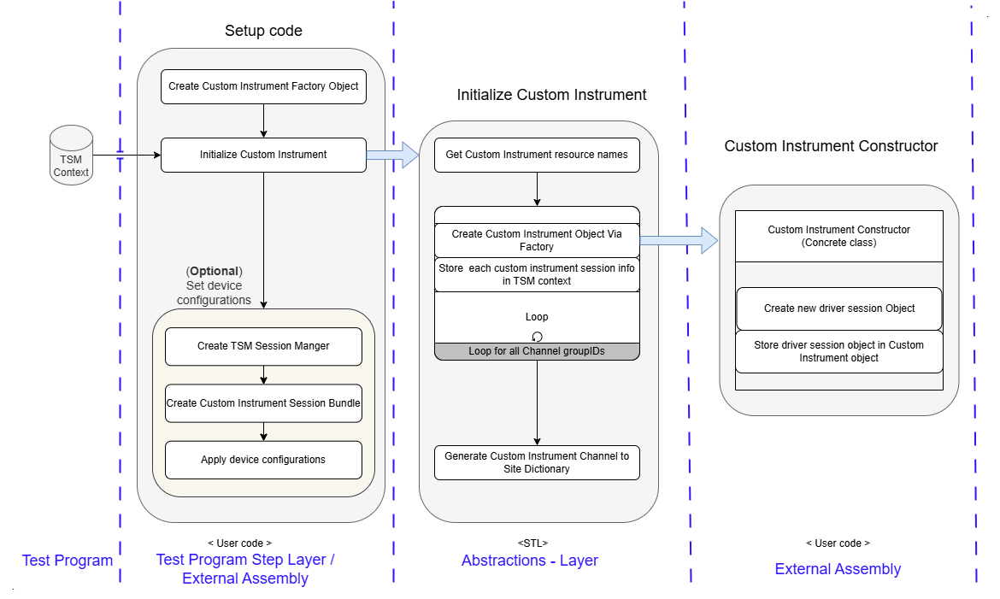
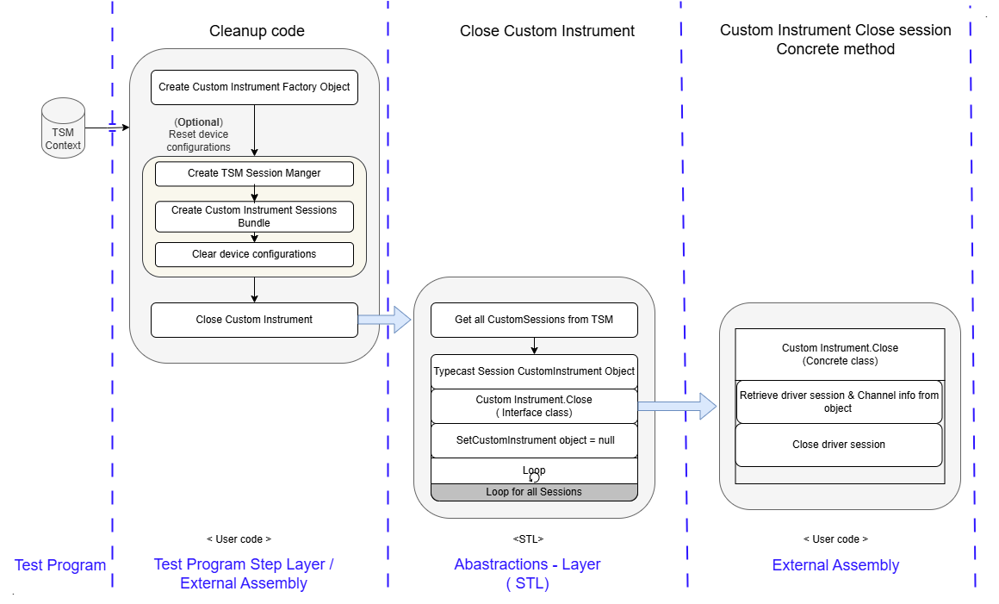
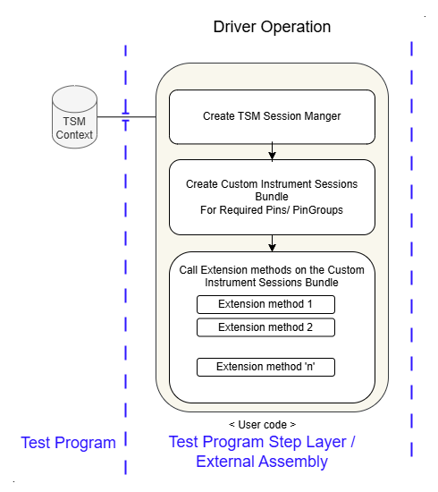

[[_TOC_]]
# Custom Instrument Support
Custom Instrument Support provides infrastructure that allows users to use non-TSM native instruments such as Third Party Instruments and NI RIO instruments via STL. Users can now define unsupported instruments as Custom Instrment in user pinmap and make use of STL methods to  perform intended operations on the instruments.

# Details
Custom Instrument support infrastructure abstracts Initialize and Close methods using Interfaces for custom instrument drivers. For each custom instrument type, user need to implement concrete methods for initialize and close by calling in to actual driver APIs. Driver initialization & closure will be taken care by STL layer through callbacks to concrete implementation. Interfaces include Custom Instrument Driver and Custom Instrument Factory (for generating custom instrument object)
As part of support infrastructure, CustomInstrument SessionInformation and CustomInstrument SessionsBundle classes are provided. Using these classes, users can store and retrieve driver session, associated pin-site information and can create extension methods for performing driver operations.

Classes and Interfaces added as part of Custom Instrment support.
- ICustomInstrument
- ICustomInstrumentFactory
- InitializeAndClose
- CustomInstrumentSessionInformation
- CustomInstrumentSessionsBundle

# How to Integrate
- User need to create concrete implementations for ICustomInstrument & ICustomInstrumentFactory.
- User need to create Setup and cleanup methods for initialization and cleanup of Instruments.
- User need to create extension methods for performing operations on the instrument.

## Implementing concrete classes
For each custom instrument type, separate concrete factory class need to be created which implements ICustomInstrumentFactory.
Concrete factory class should implement InstrumentTypeId property whch provides unique Instrument type ID.
Concrete factory class should implement CreateInstrument method which create CustomInstrument object based on the parameters provided.
Concrete factory class should implement ValidateCustomInstruments to validate Channel names and channel groups as per the pinmap.

One or more concrete Custom Instrument calss need to be created which implements ICustomInstrument depending on instrument type.
Cunstructor of the Custom Instrument calss should take care of opening unique reference to the instrument/channelgroup and store the reference as part of the CustomInstrument object data.
Instrument name and channel details need to be stored as part of object data whcih may be required for implementing close and reset method
Custom Instrument calss should implement close method to close all the references of the instrument/channelgroup.
Custom Instrument calss should implement reset method to reset instrument/channelgroup. If reset is not supported, it can be a dummy method (NOP)

## Writing Setup and cleanup methods
Need to cerate Setup and Cleanup methods which will be called from TestProgram / Test Sequence.
Setup method should take care of Initialization of the custom instruments. As part of the setup method, general configurations (usually channel indpendent configurations) can also be applied
Cleanup code should take care of closing all references and reset general configurations applied as part of setup method.

### Setup method
Setup method should create CustomInstrument factory object for each instrument type and call Initialize method with CustomInstrument factory as parameter.
Optionally apply configurations by creating Sessions bundle for all the pins

Refer [CustomInstrument Example, setup method](https://github.com/ni/semi-test-library-dotnet/blob/main/Examples/source/Sequence/CustomInstrument/Code%20Modules/SetupAndCleanupSteps.cs#L12) for creating Setup method

Setup Code workflow

### Cleanup method
Cleanup method should call close method for each CustomInstrument type by providing typeID as parameter.
Before calling close method, all configurations applied during setup method shoud be cleared.

Refer [CustomInstrument Example, Cleanup method](https://github.com/ni/semi-test-library-dotnet/blob/main/Examples/source/Sequence/CustomInstrument/Code%20Modules/SetupAndCleanupSteps.cs#L29) for creating Setup method

Cleanup code workflow

## Writing Extention methods
To perform any operations on the CustomInstrument, need to extend SessionsBundle class to perform driver operatons on the instrument. SessionsBundle contains all the informations like session, pin site data, channel string, etc.
Make use of Do methods provideded to efficiently call driver methods in parallel.
Refer: [Extending the Semiconductor Test Library](https://ni.github.io/semi-test-library-dotnet/UserGuide/advanced/ExtendingTheSemiconductorTestLibrary.html)

Inside the extension method, session we get will be of Object type, we will need to typecast it to your 'CustomInstrument' type. 
Using the CustomInstrument session, user can access driver reference and call required driver APIs or CustomInstrument itself can have methods that perform required driver operation by called driver APIs inside the methods.

Refer [CustomInstrument Example, HighLevelDriverOperations](https://github.com/ni/semi-test-library-dotnet/blob/main/Examples/source/Sequence/CustomInstrument/Code%20Modules/MyCustomInstrument/HighLevelDriverOperations.cs)

Driver operation workflow

## Writing TestSteps
Similar to other NI instruments, we need to create SessionsBundle for required pins and the call required extension methods on the bundle.
Create new instance of TSMSessionManager
Create SessionsBundle by calling CustomInstrument method of TSMSessionManager with InstrumentTypeId and required pins as parameters
Call required extension methods based on the TestProgram.

Refer [CustomInstrument Example, TestSteps](https://github.com/ni/semi-test-library-dotnet/blob/main/Examples/source/Sequence/CustomInstrument/Code%20Modules/TestStep.cs)

# Examples 
A Sequence style example has been provided to showcase implementation of 'Setup' and 'Close' methods by using Initialize and Close abstraction methods. Also, demonstrates how to write extension methods on CustomInstrument Sessions bundle.
It also demonstrates how to validate instrument and channel group against pinmap.

More details about the example can be found in [CustomInstrument Example Readme.md](https://github.com/ni/semi-test-library-dotnet/blob/main/Examples/source/README.md)
Example location: [CustomInstrument Sequence Style Example](https://github.com/ni/semi-test-library-dotnet/tree/main/Examples/source/Sequence/CustomInstrument)