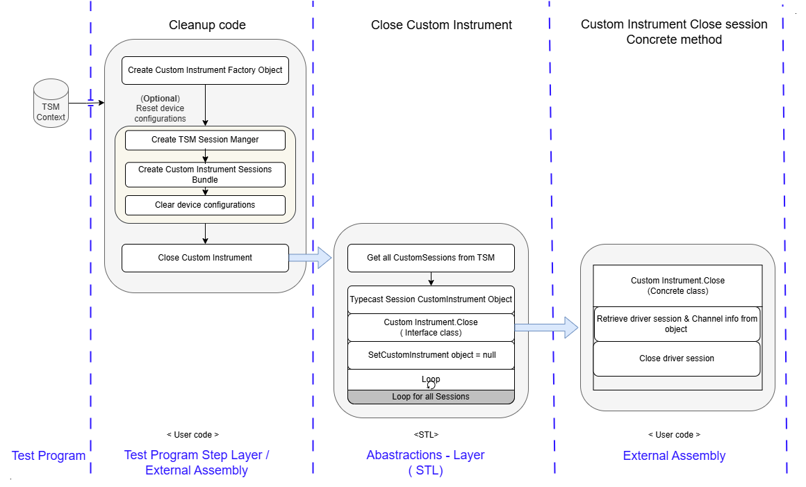
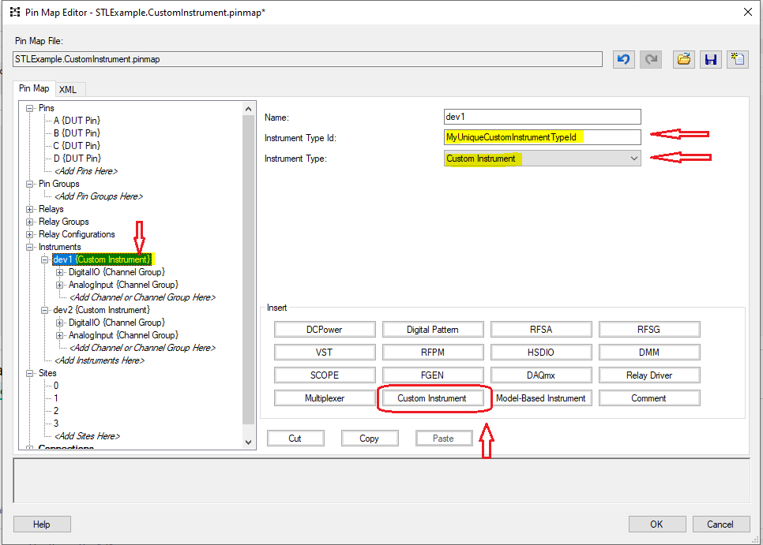

# Custom Instrument Support

The Semiconductor Test Library (STL) provides built-in support for commonly used instruments, such as NI-DCPower and NI-Digital. However, If you want to use an instrument that is not natively supported, STL provides the infrastructure to support Custom Instruments. For example, NI-RIO instruments such as FlexRIO or R-Series devices, 3rd-party devices, or even certain load board hardware can be defined and used as Custom Instruments with STL. You can define the unsupported instrument as a Custom Instrument within the pinmap and then leverage the provided interfaces and classes to abstract the device's driver and perform high-level operations on the instrument.

> [!NOTE]
> Only supported with v25.5 or later of the Semiconductor Test Library NuGet package.

## Implementation Requirements

In order to use a Custom Instrument within your test program, you must develop a basic implementation within your test program using the provided interfaces and classes.

- `ICustomInstrument`
- `ICustomInstrumentFactory`
- `InitializeAndClose`
- `CustomInstrumentSessionInformation`
- `CustomInstrumentSessionsBundle`

The following steps must be repeated for each type of custom instrument that you need to support, which may vary between instrument vendors, class, or model.

1. Create a concrete implementation for `ICustomInstrument`.
2. Create a concrete implementation for `ICustomInstrumentFactory`.
3. Create high-level setup and cleanup methods for initialization and cleanup of the instrumentation.
4. Create high-level extension methods for performing operations with the instrumentation.
5. Align the implementation to the appropriate pin map configuration.

The `ICustomInstrument` and `ICustomInstrumentFactory` interfaces are used to define concrete class implementations for wrapping the instrument's driver API.
Where the `ICustomInstrumentFactory` concrete class implementation is responsible for initially constructing the appropriate concrete `ICustomInstrument` object and designating the `InstrumentTypeId` to be used within the pin map definition.

> [!NOTE]
> There should be separate concrete class implementations of `ICustomInstrument` and `ICustomInstrumentFactory` for each type of custom instrument, or `InstrumentTypeId`, that are to be supported.
> In general, there will be a specific `InstrumentTypeId` based on how different instrument channels are grouped and defined within the pin map. Refer to [How to Configure the Pin Map](#5-how-to-configure-the-pin-map) for more details.

Additionally, for each custom instrument type, you must write high-level methods to Setup and Cleanup the instrument driver session.
This is done by utilizing the concrete implementation of the `ICustomInstrumentFactory` interface with the `Initialize` and `Close` methods provided by the `InitializeAndClose` class.
The actual initialization and closure of the driver session will happen within the `InitializeAndClose` methods, as they abstract the pin map integration and invoke the appropriate `Initialize` and `Close` methods defined by the `ICustomInstrument` interface.
You may also choose to write an additional high-level method to `Reset` the instrumentation, when a reset operation is supported by the device driver.

> [!NOTE]
> You should never need to directly invoke the `Initialize` and `Close` methods defined by the `ICustomInstrument` interface, as the library's abstraction takes care of this for you.

The `CustomInstrumentSessionInformation` class is used to encapsulate the `ICustomInstrument` object, enabling you to access the instrument driver's API session and associated pin-site information.

Finally, the `CustomInstrumentSessionsBundle` class is used to create high-level extension methods for performing driver operations that will be used to program the instrument within a test code module.
Similar to the extension methods provided by the library for natively supported instrument types, such as DCPower and Digital.

> [!TIP]
> Create a new folder within your C# project specifically to organize the various source files you will create to support your custom instrument. This allows the best portability for reusing the custom instrument implementation in future projects.

### 1. Create a Custom Instrument Class

Create a new custom instrument class that implements `ICustomInstrument` interface. For example, "MyCustomInstrument"

- Within the class constructor open a unique session reference to the instrument or channel group using the instrument driver's API. Then store that reference as a property within the class.
  - You will need to add the following `using` directive at the top of your .cs file to reference the `ICustomInstrument` interface: `using NationalInstruments.SemiconductorTestLibrary.InstrumentAbstraction.CustomInstrument;`
  - The Instrument name and channel details should also be stored as part of object data.
- The class must Implement a `Close` method to close the sessions reference to the instrument or channel-group.
- The class must implement a `Reset` method to reset instrument/channel-group.
  - If the devices does not support a reset operation then the body of this method can be left empty, but it's signature must still be defined.
  - It's a good idea to write a comment in the body of the method to denote when this operation is not supported.

### 2. Create a Custom Instrument Factory Class

Create a new concrete factory class implements the `ICustomInstrumentFactory` interface.

- The name of the class should match that of the custom instrument class you created. For example, "MyCustomInstrumentFactory".
- You will need to add the following `using` directive at the top of your .cs file to reference the `ICustomInstrumentFactory` interface: `using NationalInstruments.SemiconductorTestLibrary.InstrumentAbstraction.CustomInstrument;`.
- The class must implement a `InstrumentTypeId` property, which provides unique identifier to denote the Instrument type and will be used within the pin map.
- The class must implement the `CreateInstrument` method, which creates and returns a new instance of the object that implements the `ICustomInstrument` interface.
- The class must implement the `ValidateCustomInstruments` method, which is used to validate the channel names and channel groups in the pin map are setup as expected for the specific instrument type.
- The body of this method can be left empty, but it's signature must still be defined.

### 3. Create High-level Setup and Cleanup Methods

You need to create Setup and Cleanup methods which will be called from TestProgram/Test Sequence.
The Setup method should take care of Initialization of the custom instruments.
As part of the Setup method, an initial configuration for the instrument can also be applied (including pin specific configurations).
The Cleanup code should take care of closing all references and resetting the instrumentation (when applicable).

#### 3.1 Setup method

Create a new static class within your C# project and add a new `Setup<NameOfCustomInstrumentType>` method.
Where `<NameOfCustomInstrumentType>` is replaced by your custom instrument's name (i.e. the name of your concrete custom instrument class).

- You can create a new `SetupAndCleanupSteps` class in your project to declare the new Setup method within.
  - Alternatively, you can add this method to an existing class, if your project already contains a similar class.
- The method should create a new instance of the Custom Instrument Factory class.
- The method should call the `InitializeAndClose.Initialize` method, passing it the newly created Custom Instrument factory object as parameter.
  - You will need to add the following `using` directive to the top of your .cs file to reference the appropriate `InitializeAndClose` class: `using NationalInstruments.SemiconductorTestLibrary.InstrumentAbstraction.CustomInstrument;`.
- Optionally, you can perform any high-level operations to configuration the instrument upon its initial setup.
  - It is recommended that you do so by create a new session bundle object, as discussed in [Using Extension Methods Within Test Code Modules](#using-extension-methods-within-test-code-modules)

Refer to the [Custom Instrument Example - `SetupMyCustomInstruments` Method in SetupAndCleanupSteps.cs](https://github.com/ni/semi-test-library-dotnet/blob/main/Examples/source/Sequence/CustomInstrument/Code%20Modules/SetupAndCleanupSteps.cs#L12) as a reference for creating a Setup method.

Setup Code workflow

#### 3.2 Cleanup method

Add a new `Cleanup<NameOfCustomInstrumentType>` method to the same class you added the setup method to.
Where `<NameOfCustomInstrumentType>` is replaced by your custom instrument's name (i.e. the name of your concrete custom instrument class).

- The method should call the `InitializeAndClose.Close` method, passing it the `InstrumentTypeId` property from the concrete Custom Instrument Factory class as parameter.
  - Before calling the `InitializeAndClose.Close` method, ensure the device is properly powered down and configured, if necessary.
  - You will need to add the following `using` directive to the top of your .cs file to reference the appropriate `InitializeAndClose` class: `using NationalInstruments.SemiconductorTestLibrary.InstrumentAbstraction.CustomInstrument;`.

Refer to the [Custom Instrument Example - `CleanupMyCustomInstruments` Method in SetupAndCleanupSteps.cs](https://github.com/ni/semi-test-library-dotnet/blob/main/Examples/source/Sequence/CustomInstrument/Code%20Modules/SetupAndCleanupSteps.cs#L29) as a reference for creating a Cleanup method.

Cleanup code workflow

### 4. Create High-Level Extension Methods

To perform operations on the instrument, you need to write high-level extension methods to extend the `CustomInstrumentSessionsBundle` class.

- Refer to [Extending the Semiconductor Test Library](https://ni.github.io/semi-test-library-dotnet/UserGuide/advanced/ExtendingTheSemiconductorTestLibrary.html) for more specific instructions to get started.
- You will need to add the following `using` directives at the top of your .cs file to reference the required classes from the library:
  - `using NationalInstruments.SemiconductorTestLibrary.Common;`
  - `using NationalInstruments.SemiconductorTestLibrary.DataAbstraction;`
  - `using NationalInstruments.SemiconductorTestLibrary.InstrumentAbstraction.CustomInstrument;`
- Within each high-level extension method, make use of the `Do` and `DoAndReturnXXX` methods provided by the `ParallelExecution` class to invoke driver methods in parallel across the various pins and sites.
  - The sessions bundle contains the instrument sessions and important site, pin, and channel information you will need to perform operations on the appropriate instrument channels.
  - Refer to [Making Low-Level Driver Calls](https://ni.github.io/semi-test-library-dotnet/UserGuide/advanced/MakingLowLevelDriverCalls.html) for details.
- Implement separate extension methods to enable any and all instrument's driver API capabilities that should be used by the test program.

> [!NOTE]
> The value of the `Session` property contained within the `CustomInstrumentSessionInformation` object is a generic `object` type, you will need to typecast it to the type of your concrete class implementation of `ICustomInstrument`.
> Once typecasted appropriately, you will be able to access the driver reference stored within your concrete class and call the required driver APIs perform driver operations.
> [!TIP]
> The concrete class implementation of `ICustomInstrument` can be developed to have methods that wrap the required driver API operations.
> This is a good idea when working with driver APIs that are very low-level, and makes implementing the high-level extension methods much easier.

Refer to the [Custom Instrument Example - HighLevelDriverOperations.cs](https://github.com/ni/semi-test-library-dotnet/blob/main/Examples/source/Sequence/CustomInstrument/Code%20Modules/MyCustomInstrument/HighLevelDriverOperations.cs) as a reference.

Driver operation workflow

### 5. How to Configure the Pin Map

To configure the pin map definition for your custom instrument, you must first identify what type of hardware constraints the instrument has. Typically, this is categorized based on how the hardware device gets reserved by the device driver and whether or not the instrument channels can be operated on independently from one another within a single device (i.e. within parallel threads). There are three categories of possible configurations.

- Session per Channel
  - Each instrument has unique session data for each channel.
  - Each channel can be independently operated on in multiple threads, in parallel.
  - This mode of operation is similar to an NI-DCPower instrument.
- Session per Channel Group
  - Each instrument has two or more unique sessions, each containing a subset of channels that share a common session. 
  - For some devices, the subset of channels many only be operated on as a group within the same thread, and are not independent from one other within that group. However, the channel groups in each session can be independently operated on in multiple threads, in parallel. 
  - This mode of operation is similar to an NI-DAQmx instrument.
- Session per Instrument
  - Each instrument shares session data across the entire instrument.
  - Whether or not the channels can be interdependently operated on is dependent on the device and the device driver.
  - This mode of operation is common for many instruments, including NI-DCPower instruments which can operate in multiple modes (Session per Channel and Session per Instrument).

**Related information**: 

- [TestStand Semiconductor Module User Manual - Natively Supported and Custom Instruments (TSM)](https://www.ni.com/docs/en-US/bundle/teststand-semiconductor-module/page/natively-supported-and-custom-instruments.html)
- [TestStand Semiconductor Module User Manual - Custom Instruments (TSM)](https://www.ni.com/docs/en-US/bundle/teststand-semiconductor-module/page/custom-instruments.html)

#### Instructions

1. Open the Pin Map Editor and select an existing pin map file or create a new one.
1. Select `<Add Instruments Here>` under the 'Instruments' definition within the Pin Map tree on the left side of the Pin Map Editor.
1. Select Custom Instrument from the 'Insert' options.
1. Provide the unique resource name or identifier required to instantiate a new session with the hardware using the device driver (i.e. the instrument's alias shown in the NI MAX software).
1. Provide the unique `InstrumentTypeId` you have defined for your custom instrument within the concrete custom instrument factory class implementing the `ICustomInstrumentFactory` interface (from the [2. Create a Custom Instrument Factory Class](#2-create-a-custom-instrument-factory-class) step above).
1. Ensure `Custom Instrument` is selected for the `Instrument Type` field.
1. Create channel group and populate channel names as per the instrument hardware constraints mentioned above.
1. Update the Connections table to map the instrument channels to the appropriate pins and sites.

Refer to the [Custom Instrument Example - `STLExample.CustomInstrument.pinmap`](https://github.com/ni/semi-test-library-dotnet/blob/main/Examples/source/Sequence/CustomInstrument/STLExample.CustomInstrument.pinmap) as a reference.

> [!Note]
> Unique reference is created for each channel group specified in pinmap.

## Using Extension Methods Within Test Code Modules

Similar to the other natively supported instruments, you use the same workflow within your test code module, where you create a new sessions bundle object for the required pins and then invoke the extension methods on that bundle object.

- Create new instance of `TSMSessionManager`.
  - Ensure you have the following `using` directives at the top of your .cs file to reference the required classes from the library:
    - `using NationalInstruments.SemiconductorTestLibrary.Common;`
    - `using NationalInstruments.SemiconductorTestLibrary.DataAbstraction;`
    - `using NationalInstruments.SemiconductorTestLibrary.InstrumentAbstraction;`
- Create sessions bundle by calling `CustomInstrument` method of `TSMSessionManager`, passing it both the target pin(s) and the `InstrumentTypeId` as parameters.
- Call the high-level extension methods you created based on the test method requirements.
  - If your extension methods are not declared within the same namespace used by the test code module file, add the appropriate `using` directive at the top of your .cs file to reference that namespace.

> [!TIP]
> For convenience, you can add extension method to extend the `TSMSessionManager` class that wraps the `CustomInstrument` method for your specific Custom Instrument, so that you do not need to provide the `InstrumentTypeId` parameter.

Refer to the [Custom Instrument Example - `FunctionalTest` Method in TestStep.cs](https://github.com/ni/semi-test-library-dotnet/blob/main/Examples/source/Sequence/CustomInstrument/Code%20Modules/TestStep.cs) as a reference.

## Examples

There is a sequence style example available that showcases the implementation of a Custom Instrument.
This example can also be used as a template starting point for creating your own Custom Instrument.
Refer to the [Custom Instrument Example README](https://github.com/ni/semi-test-library-dotnet/blob/main/Examples/source/Sequence/CustomInstrument/README.md) for more details.
This example is also installed on any system using STS Software 25.5 or later, under the following directory, `C:\Users\Public\Documents\National Instruments\NI_SemiconductorTestLibrary\Examples\Sequence\CustomInstrument`.
