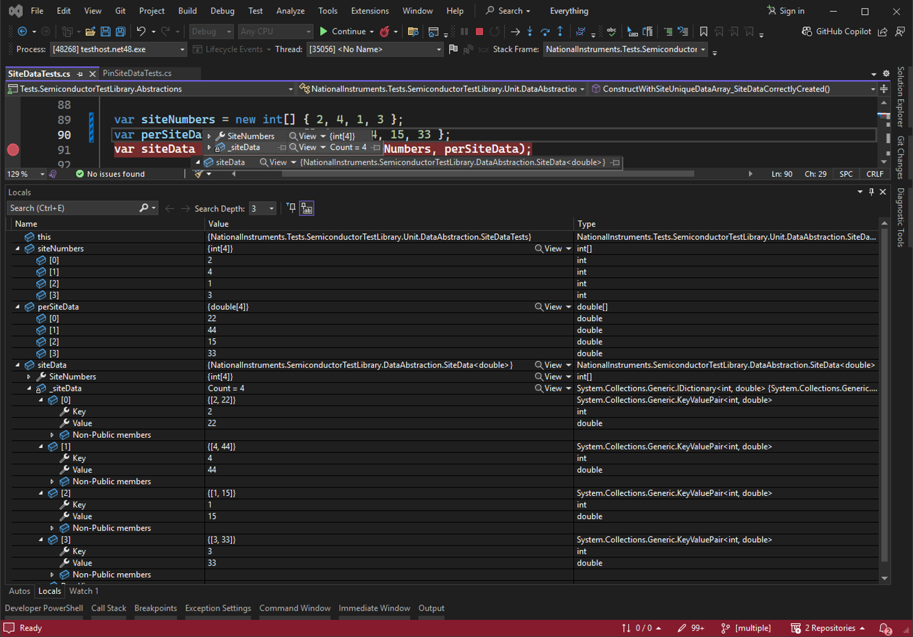
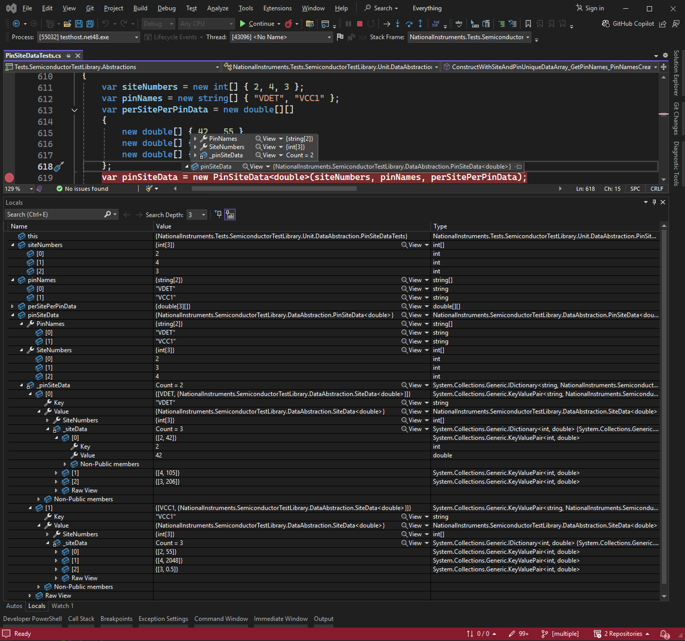

# Data Abstraction

The Semiconductor Test Library provides Pin- and Site-Aware data types to simplify how you configure instrumentation and manage returned measurement results. The high-level extension methods both return and accept these types as input parameters. This abstracts your need to manage confusing array manipulations or translate between instrument- and channel-formatted data to pin- and site-formatted data. Basic math functions can also be operated on these types.

## Pin- and Site-Aware Data Types

---

### SiteData

Class: `SiteData<T>` \
Namespace: `NationalInstruments.SemiconductorTestLibrary.DataAbstraction`

Defines an object containing values for one or more sites, where `T` can be passed as any data type.

This type is returned from methods in the Semiconductor Test Library where there may be a unique per-site value. This type can also be passed as an input parameter to some Semiconductor Test Library methods when there is a unique per-site value to operate with.

The `SiteData` object exposes basic methods for extracting a single site value or subset of values. Additionally, frequently used [mathematical operations](MathOperations/MathOperationsWithSiteData.md) can be performed on a `SiteData` object for the most commonly used data types.

>[!NOTE]
> Refer to the API Reference for more details regarding the properties and methods exposed by the `SiteData`.
>
> Find examples for using the `SiteData` object [here on GitHub](https://github.com/ni/semi-test-library-dotnet/tree/main/Examples/source/DataAbstraction).

A `SiteData` object is an immutable dictionary of key-value pairs, where each key corresponds to a unique site number, and each value represents site-specific data for that site. This is also the observable structure when debugging a `SiteData` object at runtime in Visual Studio, as shown in the example below.

**Example of `SiteData` objects in Visual Studio at runtime**

---

### PinSiteData

Class: `PinSiteData<T>` \
Namespace: `NationalInstruments.SemiconductorTestLibrary.DataAbstraction`

Defines an object containing values for one or more sites that are associated with a particular pin or set of pins, where `T` can be passed as any data type.

This type is returned from methods in the Semiconductor Test Library, such as measurement methods, where there may be a unique value for each pin, regardless of whether the value is the same across all sites and/or pins. This type can also be passed as an input parameter to some Semiconductor Test Library methods when there is a unique per-site, per-pin value to operate with.

The `PinSiteData` object exposes basic methods for extracting a single site value or subset of values. Additionally, frequently used [mathematical operations](MathOperations/MathOperationsWithPinSiteData.md) can be performed on a `PinSiteData` object for the most commonly used data types.

>[!NOTE]
> Refer to the API Reference for more details regarding the properties and methods exposed by the `PinSiteData`.
>
> Find examples for using the `PinSiteData` object [here on GitHub](https://github.com/ni/semi-test-library-dotnet/tree/main/Examples/source/DataAbstraction).

A `PinSiteData` object is an immutable dictionary of key-value pairs, where each key corresponds to a unique pin name, and each value is a `SiteData` object containing site-unique data for the given pin. This is also the observable structure when debugging a `SiteData` object at runtime in Visual Studio, as shown in the example below.

**Example of `PinSiteData` objects in Visual Studio at runtime:**

