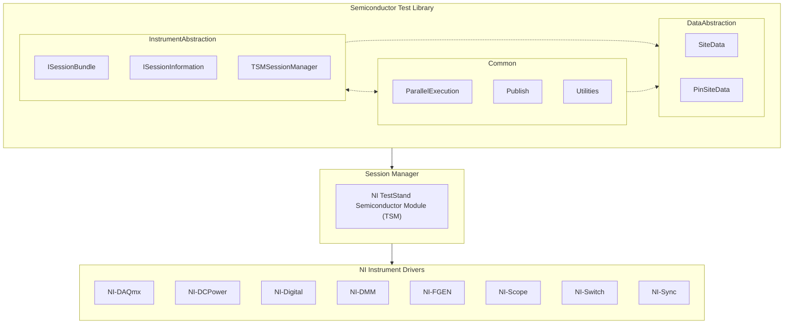

# Instrument Abstraction

The Semiconductor Test Library provides interfaces and classes for abstracting instrument sessions and encapsulating the necessary pin and site awareness.

## Need for Session Management

NI’s platform expects the user’s application to be responsible for initializing and closing the appropriate instrument sessions for the target hardware used by the application. Furthermore, NI instrument drivers are not natively pin- and site-aware, and require some kind of translation layer to program them based on a pin and channel mapping. The Semiconductor Test Library abstracts this complexity such that the test engineer no longer needs to translate between pins and instrument channels.

- An instrument session is a low-level driver reference to the hardware.
- It reserves the target hardware module(s) to only be used by the calling process.
- A single instrument session may include channels that span more than one device module of the same type.
- For example, the niDCPower driver can have a single Instrument Session established with channels from both a PXIe-4147 and PXIe-4162 SMU modules.
- A single instrument session can include channels that span multiple sites.
- Most NI driver operations target a particular instrument channel within a given session.
- Measurement results returned by the driver must be manipulated and reformatted from instrument channel results to pin- and site-specific results (which is meaningful for the test developer).

## Session Manager

The Semiconductor Test Library relies a separate session management layer to manage instrument sessions based on a pin map. The session manager is responsible for translating how a pin is mapped to specific the instrument channels across the active sites. It is also responsible the storage and retrieval of instrument session information. This means all instrument sessions are expected to be created for and stored via the session manager.

The TestStand Semiconductor Module (TSM) provides the necessary session management layer by providing both a mechanism for storing and passing initialized sessions between code modules, as well as translating how a pin is mapped to instrument session across active sites. The Semiconductor Test Library builds on top of TSM’s session management to make it more user friendly and provide high-level abstractions for programming STS instrumentation, and inclusive of pin and site aware data types.

> [!NOTE]
> The library currently only supports using the TestStand Semiconductor Module (TSM) as the session manager.



## Initializing and Closing Sessions

Using TSM as the session manager, instrument sessions are initialized once at the start of user’s test program, in the ProcessSetup callback in the user’s TestStand sequence, and then closed at the end of user’s test program, in the ProcessCleanup callback in the user’s TestStand sequence.

The Semiconductor Test Library provides instrument type specific initialization and cleanup code in the `Initialization` class.

> [!NOTE]
> Class: `Initialization`\
> Namespace: `NationalInstruments.SemiconductorTestLibrary.InstrumentAbstraction.<InstrumentType>` \
> Assembly: `NationalInstruments.SemiconductorTestLibrary.Abstractions.dll`
>
> Refer to the API Reference for more details regarding the `Initialization` class for each of various supported instrument types.

The `TestStandSteps` take this a step further by adding Setup and Cleanup step types that can can be called directly ProcessSetup and ProcessCleanup, and which leverage the `Initialization` class for each supported instrument type.

> [!NOTE]
> Class: `TestStandSteps` \
> Namespace: `NationalInstruments.SemiconductorTestLibrary.TestStandSteps` \
> Assembly: `NationalInstruments.SemiconductorTestLibrary.TestStandSteps.dll`
>
> Refer to the API Reference for more details regarding the `TestStandSteps`.

### Session Groups In Pin Maps

The instrument abstraction for certain drivers, such as niDCPower, expects instrument sessions to be configured in one or more groups within the loaded pin map. This is the default for newer pin maps, but if an older pin map is loaded that does not use session groups, the `InstrumentAbstraction.DCPower.InitializeAndClose.Initialize` method will throw and exception.

**Related information**:

- [NI TSM: Grouping Channels with the NI-DCPower Driver](https://www.ni.com/docs/en-US/bundle/teststand-semiconductor-module/page/group-channels-with-dcpower.html)
- [NI TSM: Grouping Channels with the NI-Digital Pattern Driver](https://www.ni.com/docs/en-US/bundle/teststand-semiconductor-module/page/group-instruments-with-digital.html)
- [NI TSM: Grouping Channels with the NI-SCOPE Driver](https://www.ni.com/docs/en-US/bundle/teststand-semiconductor-module/page/group-instruments-with-scope.html)

## Querying Sessions

In a given test code module, you should create a new instance of the `TSMSessionManager` at very beginning of your test method, passing it the `ISemiconductorModuleContext` object as an input. The resulting `TSMSessionManager` object can then used to query the instrumentation based on the target pin, pins, or pin groups that code needs to interact with. Refer to the example below.

> [!TIP]
> Note that there is some amount of overhead each time a new session is queried. Therefore, the programmer should minimize the amount of queries within a given code module.

```C#
string vddPinName = "VDD", sdoPinName = "SDO";
TSMSessionManager sessionManager = new TSMSessionManager(semiconductorModuleContext);
DCPowerSessionsBundle vdd = sessionManager.Digital(vddPinName);
DigitalSessionsBundle sdo = sessionManager.Digital(sdoPinName);

vdd.ForceVoltage(voltageLevel: 3.3, currentLimit: 0.1);
sdo.WriteStatic(PinState._1);
```

>[!NOTE]
Class: **`TSMSessionManager`**
>
> Description: Defines a session manager that manages instrument device sessions through TSM. This object is used to query the appropriate ISessionsBundle object for a specific pin or set of pins based on the expected mapped instrument type.
>
> Namespace: `NationalInstruments.SemiconductorTestLibrary.InstrumentAbstraction` \
> Assembly: `NationalInstruments.SemiconductorTestLibrary.Abstractions.dll`
>
> Refer to the API Reference for more details regarding the `TSMSessionManager` class.
