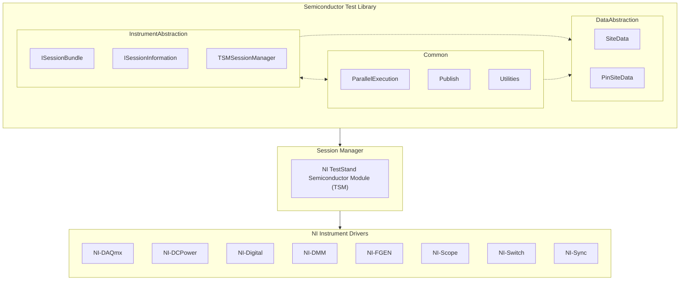

# Instrument Abstraction

The Semiconductor Test Library provides interfaces and classes for abstracting instrument sessions and encapsulating the necessary pin and site awareness.

## Session Management

Using the NI platform, you are responsible for initializing and closing the appropriate instrument sessions for the target hardware used by your application. Furthermore, NI instrument drivers are not natively pin- and site-aware, thus requiring a translation layer for you to program your application using pins and sites. The Semiconductor Test Library abstracts this complexity such that you no longer need to directly contend with this translation nor the programming of instrument channels.

- An instrument session is a low-level driver reference to the hardware, and it reserves the target hardware module(s) to be used by only the calling process.
- A single instrument session may include channels that span more than one device module of the same type.
  - For example, the niDCPower driver can have a single Instrument Session established with channels from two different SMU modules, such as the PXIe-4147 and PXIe-4162.
- A single instrument session can include channels that span multiple sites.
- Most NI driver operations target a particular instrument channel within a given session.
- Measurement results returned by the driver must be manipulated and reformatted from instrument channel results to pin- and site-specific results (which is meaningful for semiconductor test development).

### The Session Manager

The Semiconductor Test Library relies on a separate session management layer to manage instrument sessions based on a pin map. The session manager is responsible for translating how a pin is mapped to the specific instrument channels across the active sites. It is also responsible the storage and retrieval of instrument session information. All instrument sessions are expected to be created for and stored via the session manager.

The TestStand Semiconductor Module (TSM) provides the necessary session management layer by providing a mechanism for storing and passing initialized sessions between code modules, and translating how a pin is mapped to the instrument session across active sites. The Semiconductor Test Library builds on top of TSM’s session management to make it more user-friendly, provide high-level abstractions for programming STS instrumentation, and include pin- and site-aware data types.

> [!NOTE]
> The library currently only supports using the TestStand Semiconductor Module (TSM) as the session manager.



## Initializing and Closing Sessions

Instrument sessions are initialized once at the start your test program and then closed at the end of your test program. When using TSM for session management, this is expected to take place in the ProcessSetup and in the ProcessCleanup callbacks of your TestStand sequence, respectively.

The Semiconductor Test Library provides instrument type specific initialization and cleanup code in the `Initialization` class.

> [!NOTE]
> Class: `Initialization`\
> Namespace: `NationalInstruments.SemiconductorTestLibrary.InstrumentAbstraction.<InstrumentType>` \
> Assembly: `NationalInstruments.SemiconductorTestLibrary.Abstractions.dll`
>
> Refer to the API Reference for more details regarding the `Initialization` class for each supported instrument type

The `TestStandSteps.SetupAndCleanupSteps` class adds TestStand-level setup and cleanup step types that can be called directly from ProcessSetup and ProcessCleanup, which leverages the `Initialization` class for each supported instrument types.

> [!NOTE]
> Class: `SetupAndCleanupSteps` \
> Namespace: `NationalInstruments.SemiconductorTestLibrary.TestStandSteps` \
> Assembly: `NationalInstruments.SemiconductorTestLibrary.TestStandSteps.dll`
>
> Refer to the TestStandSteps Reference for more details regarding the `SetupAndCleanupSteps` class.

### Session Groups in Pin Maps

The instrument abstraction for certain drivers, such as NI-DCPower, expects instrument sessions to be configured in one or more groups within the loaded pin map. This is the default for new pin maps, but if an existing pin map that does not use session groups is loaded, the `InstrumentAbstraction.DCPower.InitializeAndClose.Initialize` method will throw an exception.

**Related information**:

- [NI TSM: Grouping Channels with the NI-DCPower Driver](https://www.ni.com/docs/en-US/bundle/teststand-semiconductor-module/page/group-channels-with-dcpower.html)
- [NI TSM: Grouping Channels with the NI-Digital Pattern Driver](https://www.ni.com/docs/en-US/bundle/teststand-semiconductor-module/page/group-instruments-with-digital.html)
- [NI TSM: Grouping Channels with the NI-SCOPE Driver](https://www.ni.com/docs/en-US/bundle/teststand-semiconductor-module/page/group-instruments-with-scope.html)

## Querying Sessions

In a given test code module, you should create a new instance of `TSMSessionManager` at the beginning of your test method and pass it to the `ISemiconductorModuleContext` object as an input. The resulting `TSMSessionManager` object can then be used to query the appropriate instrumentation based on the target pin, pins, or pin groups. Refer to the example below.

> [!TIP]
> Note that there is some overhead each time a session is queried. Therefore, you should minimize the number of queries within a given code module.

```C#
string vddPinName = "VDD", sdoPinName = "SDO";
TSMSessionManager sessionManager = new TSMSessionManager(semiconductorModuleContext);
DCPowerSessionsBundle vdd = sessionManager.Digital(vddPinName);
DigitalSessionsBundle sdo = sessionManager.Digital(sdoPinName);

vdd.ForceVoltage(voltageLevel: 3.3, currentLimit: 0.1);
sdo.WriteStatic(PinState._1);
```

>[!NOTE]
> Class: **`TSMSessionManager`**
>
> Description: Defines a session manager that manages instrument device sessions through TSM. Use a new instance of this class to query the appropriate ISessionsBundle object for a specific pin or set of pins based on the expected mapped instrument type.
>
> Namespace: `NationalInstruments.SemiconductorTestLibrary.InstrumentAbstraction` \
> Assembly: `NationalInstruments.SemiconductorTestLibrary.Abstractions.dll`
>
> Refer to the API Reference for more details regarding the `TSMSessionManager` class.
