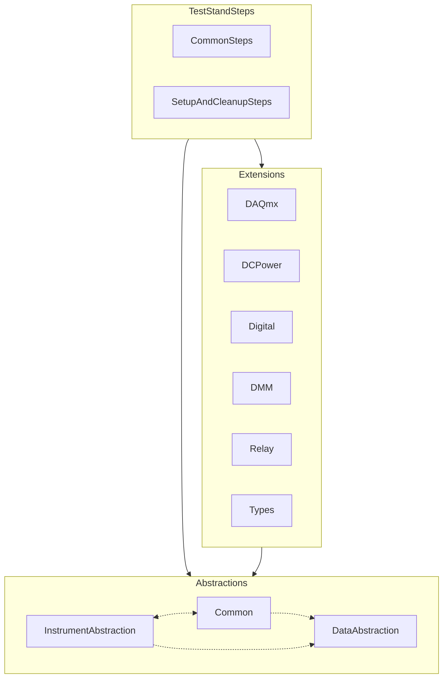

# Overview

The Semiconductor Test Library includes the following high-level features:

- Interfaces and classes—Abstract instrument sessions and encapsulate the necessary pin and site awareness.
- Pin- and site-aware data types— Simplify instrument configuration and measurement results processing.
- Parallelization methods—Abstract parallel for loops required to iterate over multiple instrument sessions regardless of how sessions map to pins or sites.
- Publishing methods—Simplify results publishing and add support for the SiteData and PinSiteData types.
- Utilities methods—Provide utility methods commonly required for writing test code.
- Extension methods—Abstract common, high-level instrument operations.
- TestStand step methods—Perform common operations, such as setting up and closing instruments, powering up a DUT, or executing common tests.

## Architecture

The following diagram illustrates a high-level overview of the Semiconductor Test Library:

The Semiconductor Test Library is compiled into the following .NET assemblies:

| Assembly                                                      | Description                                    |
| ------------------------------------------------------------- | ---------------------------------------------- |
| NationalInstruments.SemiconductorTestLibrary.**Abstractions**.dll | Abstractions for pin- and site-aware data types, instrument sessions management, as well as parallelization, publishing, and core utilities. |
| NationalInstruments.SemiconductorTestLibrary.**Extensions**.dll       | Extensions for common, high-level instrument operations built using the abstractions. |
| NationalInstruments.SemiconductorTestLibrary.**TestStandSteps**.dll  | Step methods used by TestStand. A test sequence references this assembly when you drag and drop step types in TestStand. |

The `Abstractions` and `Extensions` assemblies are combined into a single NuGet package that can be referenced by a test program.

> [!NOTE]
> The source code for the `Extensions` and `TestStandSteps` is publicly available on the GitHub ([semi-test-library-dotnet](https://github.com/ni/semi-test-library-dotnet)).

## Installation

As of STS Software 24.5, the Semiconductor Test Library is included as a component of the STS Software bundle. The NuGet package is included as part of the NI Default C#/.NET template used by the STS Project Creation Tool.

> [!NOTE]
> The `Abstractions` & `Extensions` assemblies are installed under the following directory, as they will be referenced by other STS Software components: `C:\Program Files\National Instruments\Shared\NI_SemiconductorTestLibrary`. However, a test program should reference the NuGet package instead of the installed assembly files.
>
> Using the NuGet package allows test programs the option to use the latest version of Semiconductor Test Library without needing to upgrade the STS Software. Refer to [NuGet Package Management For STS Projects](NuGetPackageManagementForSTSProjects.md) for more details.

Additionally, the `TestStandSteps` assembly is installed under the TestStand directory: `C:\Program Files\National Instruments\TestStand <version>\Components\StepTypes\NI_SemiconductorTestSteps\NationalInstruments.SemiconductorTestLibrary.TestStandSteps.dll`. TestStand will reference this assembly for Step Types that can be found in TestStand Insertion Palette.

>[!NOTE]
> Refer to [Using TestStand Steps](UsingTestStandSteps.md) for more information.
