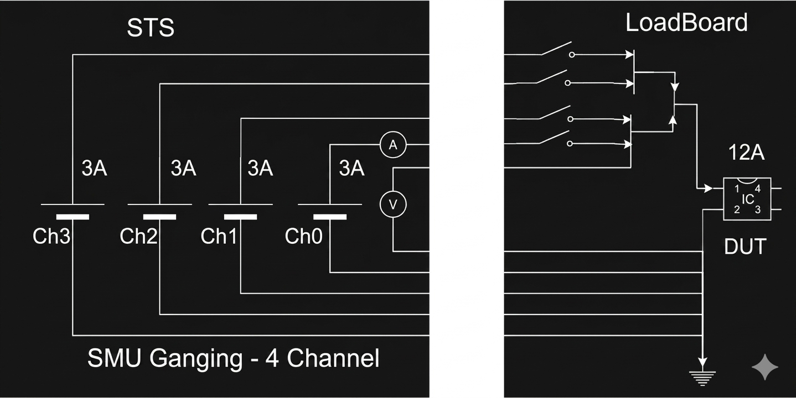
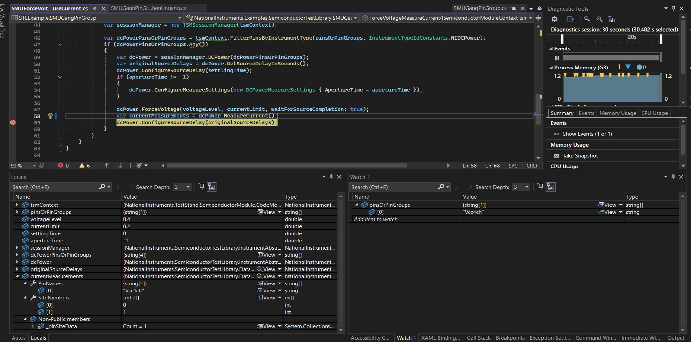
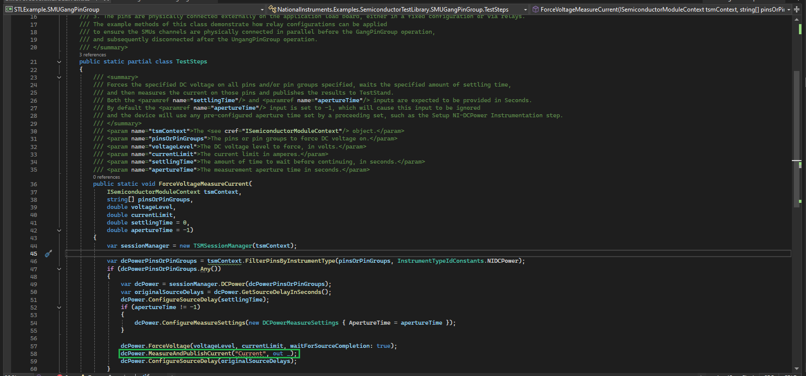
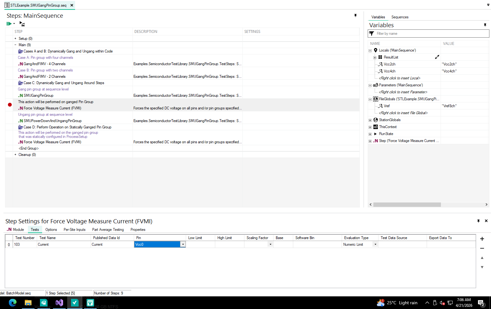
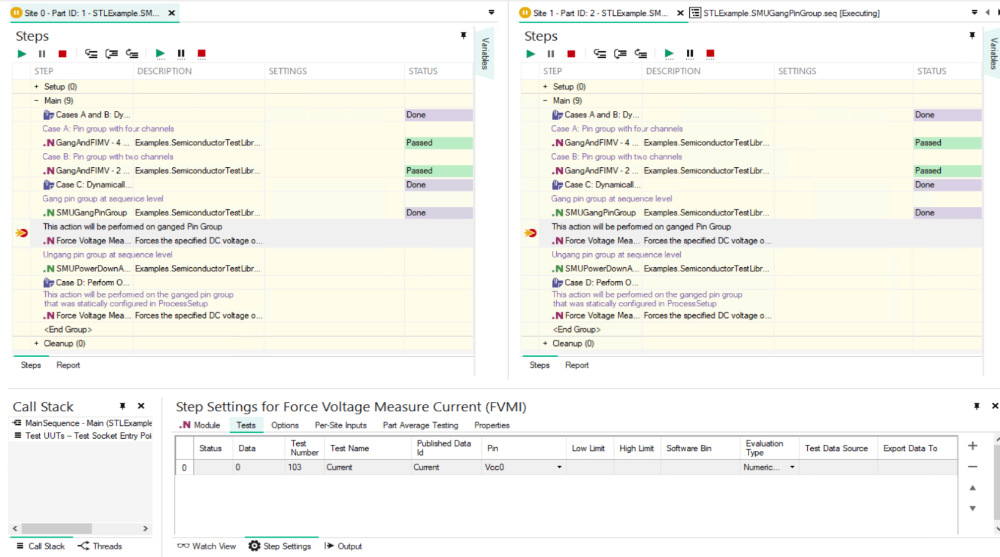

# SMU Gang Pin Group

The DCPower Instrument Abstraction allows you to gang SMU pins together to achieve higher current output than a single channel of any SMU can provide.

STL supports this functionality by programmatically tying all the channels of a ganged pin group together, sharing equal current levels and limits across the channels and synchronizing them to act together.

The SMU Gang Pin Group feature manages all of the necessary triggering, current level/limit splitting, and current measurement combining required to ensure a ganged pin group operates as a single synchronized unit per site. This allows ganging configurations that are not otherwise possible using the NI-DCPower driver's Merged Channels capability.

> [!NOTE]
> Supported in Semiconductor Test Library 26.0 NuGet package or later.

## Hardware Requirements

### Supported Instruments

The following SMUs modules have been fully tested to validate that they support ganging feature in STL:

- [PXIe-4137](https://www.ni.com/docs/en-US/bundle/pxie-4137/page/user-manual-welcome.html)
- [PXIe-4139](https://www.ni.com/docs/en-US/bundle/pxie-4139/page/user-manual-welcome.html)
- [PXIe-4150](https://www.ni.com/docs/en-US/bundle/pxie-4150/page/user-manual-welcome.html)
- [PXIe-4147](https://www.ni.com/docs/en-US/bundle/pxie-4147/page/user-manual-welcome.html)
- [PXIe-4162](https://www.ni.com/docs/en-US/bundle/pxie-4162/page/user-manual-welcome.html)
- [PXIe-4163](https://www.ni.com/docs/en-US/bundle/pxie-4163/page/user-manual-welcome.html)

> [!NOTE]
> - This is not a comprehensive list.
> - Ganged pin groups can only include SMU channels that support source and measure triggers. However, sequence mode operations require all channels of the ganged pin group to also support start and sequence advance triggers.
> - Channels from different single or multi-channel SMUs can be ganged together. In this case, the current shared by each channel cannot exceed the current rating of the lowest rated SMU channel.
> - Any number of channels can be ganged.
> - Channels can be ganged in any order.
> - Basic voltage and current sequence operations can be preformed with ganged pin groups, but more advance synchronized sequence operations are not currently supported.

### Physical Connections

All the channels of a ganged pin group must be physically connected on the application load board, either statically (always ganged together) or dynamically using a MUX or relays.
For remote sensing, sense wires of all ganged channels must be connected.

The following image illustrates an example of the relay-based dynamic connections for a two-channel gang:


## Theory of Operations

Each ganged pin group has the following two types of channels:

- **Leader channel**: The lead channel, which is responsible for driving source and measurement operations. The other channels of the group are synchronized to this channel.
- **Follower channels**: The channels that are synchronized with the leader channel for source and measurement operations.

The Current Level and Current Limit values are split equally across all channels.

STL sets the source and measure triggers for the follower channels to synchronize them with the source and measurement operations preformed by the leader channel. 
When preforming voltage or current sequencing operations with a ganged pin group, the start trigger and sequence advance trigger are also set for follower channels.

> [!Note]
> For the following methods, `PinSiteData` input can specify values either per pin or for the entire ganged pin group using the pin group name. Per-pin values are applied directly, while a pin group value is divided evenly across the pins in the group. All other Configure methods require per-pin input and do not support pin group names.
> - `ForceVoltage`
> - `ForceCurrent`
> - `ForceCurrentSequence`
> - `ForceVoltageSequence`
> - `ConfigureSourceSettings`
> - `ConfigureCurrentSequence`
> - `ConfigureVoltageSequence`

## Pin Map Requirements

The ganged channels must all map to DUT pins in the pin map file on a per-site basis. The pins are then assigned to a dedicated pin group and the pin group only contains the pins mapped to the channels being ganged.

Use the following procedure to configure the pin map to use a ganged pin group:

1. Add DUT pin definitions for each of the channels being ganged. For example, "Vcc0", "Vcc1", "Vcc2".
2. Add a new pin group definition. Use a name that is appropriate for the combined pin. For example, "Vcc" or "Vcc_Ganged".
3. Assign each of the pins created in Step 1 to the pin group created in Step 2.

> [!NOTE]
> Unlike the pin map requirements for [SMU Merge Pin Group](SMUMergePinGroup.md#pin-map-requirements), the order of the pins in the pin group that is used for ganging is not relevant to the end user. However, note that the channel mapping to the first pin of the pin group is designated as the Leader channel when the gang operation is preformed.

The following example pin map file illustrates a pin group of two pins being ganged for two sites.

```xml
<?xml version="1.0" encoding="utf-8"?>
<PinMap schemaVersion="1.6" xmlns="http://www.ni.com/TestStand/SemiconductorModule/PinMap.xsd" xmlns:xsi="http://www.w3.org/2001/XMLSchema-instance">
    <Instruments>
        <NIDCPowerInstrument name="SMU_4137_C1_S05" numberOfChannels="1">
            <ChannelGroup name="CommonDCPowerChannelGroup" />
        </NIDCPowerInstrument>
        <NIDCPowerInstrument name="SMU_4137_C1_S06" numberOfChannels="1">
            <ChannelGroup name="CommonDCPowerChannelGroup" />
        </NIDCPowerInstrument>
        <NIDCPowerInstrument name="SMU_4137_C1_S07" numberOfChannels="1">
            <ChannelGroup name="CommonDCPowerChannelGroup" />
        </NIDCPowerInstrument>
        <NIDCPowerInstrument name="SMU_4137_C1_S08" numberOfChannels="1">
            <ChannelGroup name="CommonDCPowerChannelGroup" />
        </NIDCPowerInstrument>
    </Instruments>
    <Pins>
        <DUTPin name="Vcc0" />
        <DUTPin name="Vcc1" />
    </Pins>
    <PinGroups>
        <PinGroup name="Vcc">
            <PinReference pin="Vcc0" />
            <PinReference pin="Vcc1" />
        </PinGroup>
    </PinGroups>
    <Sites>
        <Site siteNumber="0" />
        <Site siteNumber="1" />
    </Sites>
    <Connections>
        <Connection pin="Vcc0" siteNumber="0" instrument="SMU_4137_C1_S05" channel="0" />
        <Connection pin="Vcc1" siteNumber="0" instrument="SMU_4137_C1_S06" channel="0" />
        <Connection pin="Vcc0" siteNumber="1" instrument="SMU_4137_C1_S07" channel="0" />
        <Connection pin="Vcc1" siteNumber="1" instrument="SMU_4137_C1_S08" channel="0" />
    </Connections>
</PinMap>
```
> [!NOTE]
> The Ganged Pin Group feature is supported in the following DCPower session group configurations:
>   - The session groups are configured as a common session for all instruments
>   - Different sessions are configured for each instrument
>   - A separate session is configured for each channel

## Code Requirements

The gang operation must be performed within the test program at runtime, after instrument sessions are initialized.

> [!NOTE]
> This design preserves access to individual channels when they are programmatically ganged through external relays or multiplexers for specific high-current tests. This allows you to use the channels individually for other tests, and gang them only when higher current is required.

You can use the `GangPinGroup` method with a `DCPowerSessionsBundle` object that contains the pin group to perform the gang operation with the instrument.
Similarly, you can use the `UngangPinGroup` method to un-gang the channels in the pin group.
As a best practice, perform the gang operations at the start and end of the test program, unless performing a dynamic gang for specific tests.
Once the channels are ganged, all subsequent DCPower Extension methods operate on the bundle as if the pin group were a single pin.

> [!Note]
> When using `TSMSessionManager.DCPower` to create a `DCPowerSessionsBundle`, you can specify either the ganged pin group name or the individual pin names within the group. Using the pin group name is recommended.
> If you specify individual pin names for a ganged pin group, you must include all pins in the group when the group is actively ganged (after calling `GangPinGroup`). Otherwise, `TSMSessionManager.DCPower` throws an exception.

> [!Warning]
> Do not perform low-level driver operations to configure the ganged channels after invoking the GangPinGroup method on the ganged pin group. Such operations override the configuration that STL sets for ganging and might have adverse effects.

## Example Usage

The following C#/.NET code snippet shows how to use `GangPinGroup()` and `UngangPinGroup()` API calls to perform Ganging and Unganging operation on the `Vcc` PinGroup defined in the pin map file above.

``` C#
var sessionManager = new TSMSessionManager(tsmContext);
var smuBundle = sessionManager.DCPower("Vcc");

// Perform ganging operation on the pin group.
smuBundle.GangPinGroup("Vcc");

// Source and measure the signals.
smuBundle.ForceCurrent(currentLevel, voltageLimit, waitForSourceCompletion: true);
smuBundle.MeasureAndPublishCurrent(publishedDataId: "GangedCurrent");

// Use the SMU Bundle object to perform unganging operation on the pin group.
smuBundle.UngangPinGroup("Vcc"); 
```

For a sequence style example that showcases a complete working example of ganging SMU pin groups, see [SMUGangPinGroup Example README](https://github.com/ni/semi-test-library-dotnet/blob/main/Examples/source/Sequence/SMUGangPinGroup/README.md).
This example is installed along STS Software 26.0 or later, under the `C:\Users\Public\Documents\National Instruments\NI_SemiconductorTestLibrary\Examples\Sequence\SMUGangPinGroup` directory.

## Measurement Data

When a ganged pin group is present within a `DCPowerSessionsBundle` object, the `MeasureCurrent` and `MeasureVoltage` methods returns a `PinSiteData` containing data associated with the pin group name. If there are non-ganged pins or pin groups contained and measured as part of the same bundle object, their measurement data is associated with their respective individual pin names. The following screenshot provides an example for this behavior:



The measured current value of a ganged pin group reflects the total combined current across all ganged channels that map to the pin group. In this case, the measured voltage value reflects a common voltage for all of the ganged channels that are mapped to the pin group.

> [!NOTE]
> - The following get methods always return a 'PinSiteData' object that contains the property values that are associated with individual pins in a ganged pin group.
>     - `GetApertureTimeInSeconds`
>     - `GetPowerLineFrequency`
>     - `GetCurrentLimits`
>     - `GetSourceDelayInSeconds`
>
> - If the `MeasureWhen` property is set to `AutomaticallyAfterSourceComplete`, only the first measurement taken returns valid data. To generate a subsequent measurements you must must re-initiate the output. The `MeasureWhen` and `MeasureTrigger` properties should not be configured for individual ganged pins. Doing so will result in an exception being thrown.
>
>   ```cs
>   var sessionManager = Initialize(pinmap);
>   var dcPower = sessionManager.DCPower(new[] { "PowerPins" });
>   var dcpowerMeasureSettings = new DCPowerMeasureSettings() { MeasureWhen = DCPowerMeasurementWhen.AutomaticallyAfterSourceComplete, ApertureTime = 0.001 };
>   dcPower.GangPinGroup("PowerPins");
>   dcPower.ConfigureMeasureSettings(dcpowerMeasureSettings);
>   dcPower.Initiate();
>   dcPower.MeasureVoltage();
>   dcPower.MeasureVoltage() // Will throw fetch time out exception;
>   ```

> [!TIP]
> You can get the measurement results for the individual pins of a ganged pin group rather than a single result for the entire group. Use the `DoAndReturnPerSitePerPinResults` and `MeasureVoltageAndCurrent` methods, as seen in the following example:
>
> ```cs
> var voltageResults = sessionsBundle.DoAndReturnPerSitePerPinResults(sessionInfo => sessionInfo.MeasureVoltageAndCurrent().Item1)
> var currentResults = sessionsBundle.DoAndReturnPerSitePerPinResults(sessionInfo => sessionInfo.MeasureVoltageAndCurrent().Item2)
> ```

The `MeasureAndPublishCurrent`, `MeasureAndPublishVoltage` and `PublishResults` methods publish the measurement results using the name of the first pin in the ganged pin group, which corresponds to the leader channel. When working with ganged pin groups, specify the leader pin name in the Pin field of related tests in the Test tab of the calling TestStand step.

> [!NOTE]
> While the TestStand Semiconductor Module (TSM) allows values to be published by pin group name, TSM requires separate values for each of the pins within the pin group. For ganged pins, results are returned for the pin group as a combined value across all pins. As a result, publishing individual pin results is not meaningful. Instead, only publish the combined result across the ganged pins.

> [!TIP]
> If you do not want to associate the published data with a pin, you can extract the data from the `PinSiteData` object by the ganged pin group name, using the `ExtractPin` method, and then only publish the returned `SiteData` object without associating it with any pin(s) by passing it to the `PublishResults` method.
>
> ```cs
> var results = dcPower.MeasureCurrent();
> tsmContext.PublishResults(results.ExtractPin("GangedPinGroupName"), publishedDataId: "Current");
> ```

The following images show a code module that invokes the 'MeasureAndPublishCurrent' method, along with a TestStand step that calls this module. The images also illustrate how the Test tab of the calling step appears at both edit time and run time.
At edit time, the test item in the Test tab is configured with the leader pin name in the Pin field, and the Published Data ID field matches the value "Current" used by the code module.




