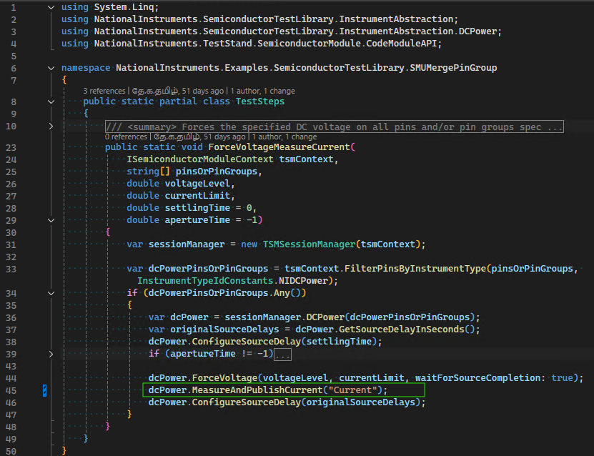

# SMU Merge Pin Group

The DCPower Instrument Abstraction allows you to merge SMU pins together to achieve higher current output than a single independent channel of the SMU can provide.

This works by taking advantage of a NI-DCPower driver capability known as Merged Channels, which allows the user to combine multiple channels on a single multi-channel SMU to work in unison. Merging channels requires you to designate a primary channel and programmatically combine it with other compatible merge channels.

- Primary channel: The channel you access when programming merged channels in the low-level driver session.
- Merge channels: The channels that you specify with the Merged Channels property. The merge channels work in unison with the primary channel.

> [!NOTE]
> Supported in Semiconductor Test Library 25.5 NuGet package or later.

## Hardware Requirements

### Supported Instruments

Merging of an SMU pin group is supported when using the following multi-channel SMUs:

- [PXIe-4147](https://www.ni.com/docs/en-US/bundle/pxie-4147/page/merged-channels.html), supports 2 channel and 4 channel merging.
- [PXIe-4162](https://www.ni.com/docs/en-US/bundle/pxie-4162/page/merged-channels.html), supports 2 channel and 4 channel merging.
- [PXIe-4163](https://www.ni.com/docs/en-US/bundle/pxie-4163/page/merged-channels.html), supports 2 channel, 4 channel, and 8 channel merging.

### Physical Connections

The designated primary and merge channels must be physically connected on the application load board, either statically (always merged together) or dynamically using a MUX or relays.
For remote sensing, only the primary channel sense wire must be connected.

The following image illustrates an example of the relay-based dynamic connections for a 4 channel merge:


> [!NOTE]
> Only certain channels on a device can be used as primary channels. Refer to the individual device user manuals, linked above, for more details including the following topics:
>
> - Valid Merge Configuration
> - Designing Merge Circuitry
> - Effect of Merging Channels on Performance Specifications.

## Pin Map Requirements

The designated primary and merge channels must all map to DUT pins in the pin map file on a per-site basis. Channels mapped to a particular site must all be from the same instrument, and that instrument must support Merged Channels (refer to [Hardware Requirements](#hardware-requirements)). It is possible to map multiple sites to the same instrument, depending on the merge configuration (x2, x4, or x8). The pins are then assigned to a dedicated pin group, where the pin mapping to the primary SMU channel is the first element in the pin group and the pin group only contains the pins mapped to the channels being merged.

Use the following procedure to configure the pin map to use a merged pin group:

1. Add DUT pin definitions for each of the channels being merged. For example, "Vcc_0", "Vcc_1", "Vcc_2" and so on.
2. Ensure that the channels mapped to any particular site are all from the same instrument, and the instrument supports Merged Channels (refer to [Hardware Requirements](#hardware-requirements))
3. Add a new pin group definition. Use a name that is appropriate for the combined pin. For example, "Vcc" or "Vcc_Merged".
4. Assign each of the pins created in step 1 to the pin group created in step 3.
5. Ensure that the first pin in the pin group is mapped to the primary channel of the merged channel group and the pin group only contains the pins mapped to the channels being merged.

The following example pin map file illustrates a pin group of two pins being merged for two sites.

```<?xml version="1.0" encoding="utf-8"?>
<PinMap schemaVersion="1.6" xmlns="http://www.ni.com/TestStand/SemiconductorModule/PinMap.xsd" xmlns:xsi="http://www.w3.org/2001/XMLSchema-instance">
    <Instruments>
        <NIDCPowerInstrument name="SMU_4147_C1_S05" numberOfChannels="4">
            <ChannelGroup name="CommonDCPowerChannelGroup" />
        </NIDCPowerInstrument>
    </Instruments>
    <Pins>
        <DUTPin name="Vcc0" />
        <DUTPin name="Vcc1" />
    </Pins>
    <PinGroups>
        <PinGroup name="Vcc">
            <PinReference pin="Vcc0" />
            <PinReference pin="Vcc1" />
        </PinGroup>
    </PinGroups>
    <Sites>
        <Site siteNumber="0" />
        <Site siteNumber="1" />
    </Sites>
    <Connections>
        <Connection pin="Vcc0" siteNumber="0" instrument="SMU_4147_C1_S05" channel="0" />
        <Connection pin="Vcc1" siteNumber="0" instrument="SMU_4147_C1_S05" channel="1" />
        <Connection pin="Vcc0" siteNumber="1" instrument="SMU_4147_C1_S05" channel="2" />
        <Connection pin="Vcc1" siteNumber="1" instrument="SMU_4147_C1_S05" channel="3" />
    </Connections>
</PinMap>
```

## Code Requirements

The merge operation must be performed within the test program at run-time, once instrument sessions are initialized.

> [!NOTE]
> This flexible design preserves access to individual channels for situations where channels are programmatically merged with external relays or MUX only for certain tests that demand higher current. Allowing you to take advantage of the individual channels during other tests, or vice versa.

You can use the `MergePinGroup` method with a `DCPowerSessionsBundle` object that contains the pin group to perform the merge operation with the instrument.
Similarly, you can use the `MergePinGroup` method to un-merge the channels in the in group.
As a best practice, perform the merge operations at the start and end of the test program, unless performing a dynamic merge for specific tests.
Once the merge operation has been performed, all subsequent DCPower Extension methods can be used on the bundle, and will operate on the pin group as if it were one single pin in the bundle.

> [!NOTE]
> The `DCPowerSessionsBundle` must be created using the Merged Pin Group by pin group name when attempting to perform merged operations. Do not create the `DCPowerSessionsBundle` using the individual pin names within the Merged Pin Group.

## Example Usage

The following C#/.NET code snippet shows how to use `MergePinGroup()` and `UnmergePinGroup()` API calls to perform Merging and Unmerging operation on the `Vcc` PinGroup defined in the above pin map file.

``` C#
var sessionManager = new TSMSessionManager(tsmContext);
var smuBundle = sessionManager.DCPower("Vcc");

// Perform merge operation on the pin group.
smuBundle.MergePinGroup("Vcc");

// Source and/or measure the signals.
smuBundle.ForceCurrent(currentLevel, voltageLimit, waitForSourceCompletion: true);
smuBundle.MeasureAndPublishCurrent(publishedDataId: "MergedCurrent");

// Use the SMU Bundle object to perform unmerge operation on the pin group.
smuBundle.UnmergePinGroup("Vcc");
```

There is also a sequence style example available that showcases a complete working example of merging SMU pin groups.
Refer to the [SMUMergePinGroup Example README](https://github.com/ni/semi-test-library-dotnet/blob/main/Examples/source/Sequence/SMUMergePinGroup/README.md) for more details.
This example is also installed on any system using STS Software 25.5 or later, under the following directory, `C:\Users\Public\Documents\National Instruments\NI_SemiconductorTestLibrary\Examples\Sequence\SMUMergePinGroup`.

## Measurement Data

When a merged pin group is present within a `DCPowerSessionsBundle` object, the `MeasureCurrent` and `MeasureVoltage` methods will return a `PinSiteData` containing data associated with the pin group name. If there are non-merged pins or pin groups contained and measured as part of the same bundle object, their measurement data will be associated with their respective individual pin names. Refer to the screenshot below as an example.


The measured current value of a merged pin group will reflect the total combined current across all merged channels that map to the pin group. Whereas, the measured voltage value will reflect a common voltage for all of the merged channels mapped to the pin group.

> [!NOTE]
> When the lower-level DCPower driver method is called to perform a measurement, only the primary channel is operated on. The driver returns the combined measurement result taken across all pins in unison

The `MeasureAndPublishCurrent` and `MeasureAndPublishVoltage`, and `PublishResults` methods will publish the measurement results using the primary pin name. It is recommended that you specify the primary pin in the pin field of related tests in the Test tab of the calling TestStand step when working with merged pin groups.
> [!NOTE]
> While the TestStand Semiconductor Module (TSM) allows values to be published by pin group name, it requires separate values for each of the pins within the pin group. For merged channels, only one of mapped channels has a returned measurement value, as discussed in the preceding note above, which is the value associated with the primary pin. There are no values for the secondary pins to publish and therefore results are not published by the pin group name when working with merged pin groups.

> [!TIP]
> If you do not want to associate the published data with a pin, you can extract the data from the `PinSiteData` object by the merged pin group name, using the `ExtractPin` method, and then only publish the returned `SiteData` object without associating it with any pin(s) by passing it to the `PublishResults` method.
>
> ```cs
> ​var results = dcPower.MeasureCurrent();
> tsmContext.PublishResults(results.ExtractPin("MergedPinGroupName"), publishedDataId: "Current");
> ```

The following images show a code module, which invoking the `MeasureAndPublishCurrent` method, being called from a step in a TestStand Sequence, and how the Test tab of the calling step appears both at edit-time and at run-time. Note that the Primary pin is configured in the Tests tab of calling step at edit-time.



