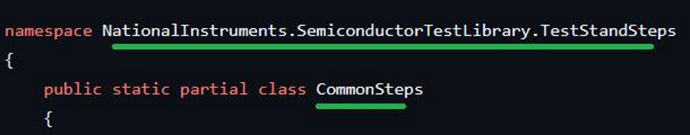

# Customizing TestStandSteps

Leverage the source code for any of the TestStandSteps available in the Semiconductor Test Library to customize the implementation to meet your specific application's needs using the procedure outlined below.

1. Download the .cs file for the desired TestStandStep method from the [semi-test-library](https://github.com/ni/semi-test-library-dotnet/tree/main/SemiconductorTestLibrary.TestStandSteps/source) GitHub repo (i.e. SemiconductorTestLibrary.TestStandSteps/source/DutPowerUp.cs).

   > [!TIP]
   > There will be one file per TestStandStep method.
   >
   > Downloading the whole file ensures all of the using declarations and any private methods are properly included (only exceptions called out in step #2).

2. For the following TestStandSteps you will also need to download the [Shared.cs](https://github.com/ni/semi-test-library-dotnet/blob/main/SemiconductorTestLibrary.TestStandSteps/source/Shared.cs):

   - [DutPowerUp.cs](https://github.com/ni/semi-test-library-dotnet/blob/main/SemiconductorTestLibrary.TestStandSteps/source/DutPowerUp.cs)
   - [ContinuityTest.cs](https://github.com/ni/semi-test-library-dotnet/blob/main/SemiconductorTestLibrary.TestStandSteps/source/ContinuityTest.cs)
   - [CleanupInstrumentation.cs](https://github.com/ni/semi-test-library-dotnet/blob/main/SemiconductorTestLibrary.TestStandSteps/source/CleanupInstrumentation.cs)

3. Add the download .cs file(s) to your project source.
4. Rename the Namespace and Class name within the file(s) to match your project.

   

5. Customize the method to meet your application's needs
6. Rebuild your project source.
7. When calling from TestStand, place a new Semiconductor Multi Test step in the desired sequence, and within the Module Tab for that step, point it to the newly added custom method within your project's assembly. Add any required Tests to the Tests tab for published data results.

> [!NOTE]  
> This procedure assumes the required dependencies are referenced in your source project. This will be true if the project was originally generated by the STS Project Creation Tool (PCT) in STS Software 24.5.0 or later, or it has the necessary project references aligned with the .csproj file in the NI Default C# template (used by the PCT).
